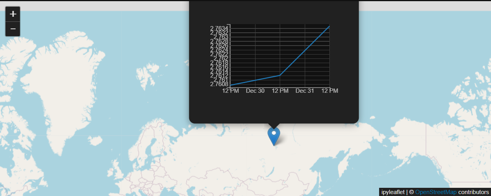

# ORT_Test : Old Reliable Technology Intro Test
 ORT Test is a suite of tools used to allow the user to click on any point on a world map to display hydrological data as a time series graph in a popup.

 DISCLAIMER This Project is a test and is only designed for testing purposes. 

 ## Instructions for Data Download:
 Go to the Climate Data Store (CDS) website: https://cds.climate.copernicus.eu/#!/home and create an account.
 
 Create API key for account, put into file .cdsapirc:
 `url: https://cds.climate.copernicus.eu/api/v2
 key: API_KEY_HERE`
 
 Install the CDS API via pip:
 `pip install cdsapi`

 Run notebook download_data.ipynb in repo

